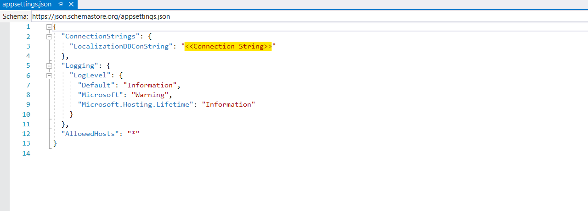

# How to Perform Localization using Database instead of Resource Files in Blazor

This example shows how to perform the localization by using the database without using the resource files in Blazor.

**Steps to run the demo**

* Clone/Download the demo and open Project in Visual studio 2019/2022
* Double click the `SyncLocalization.mdf` file in `App_Data` for load the Database table
* Once Database loaded, then Get/Copy the connection string by click the Database properties.
* Paste the connection string in `appsettings.json`

* Run the project

